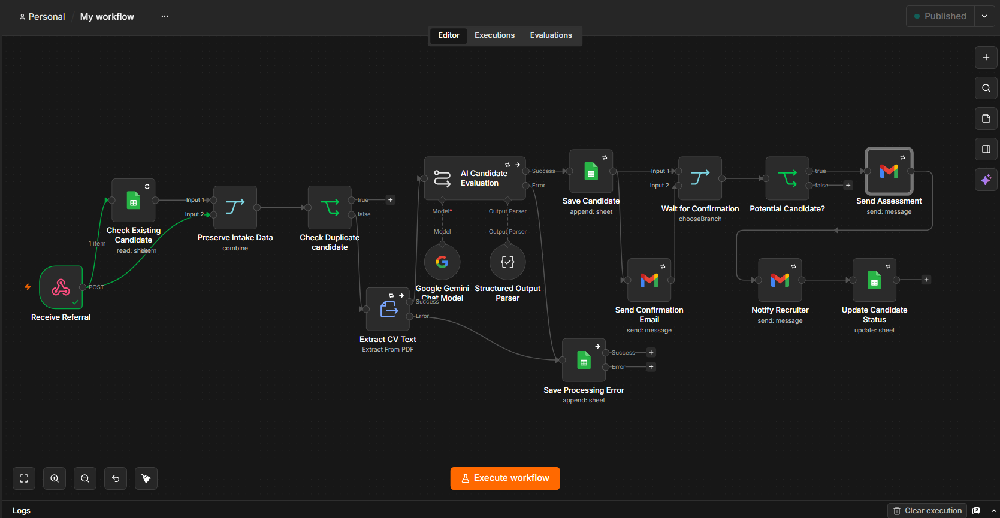
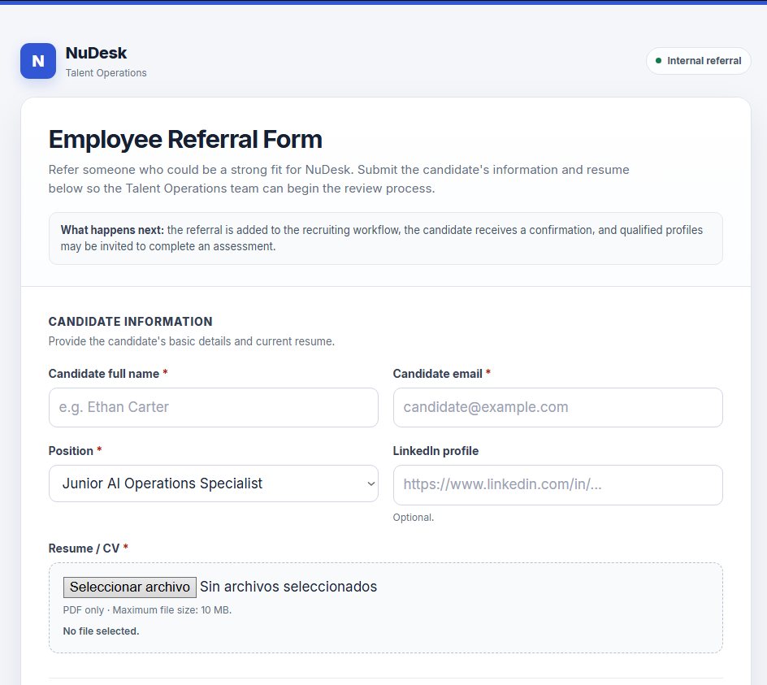
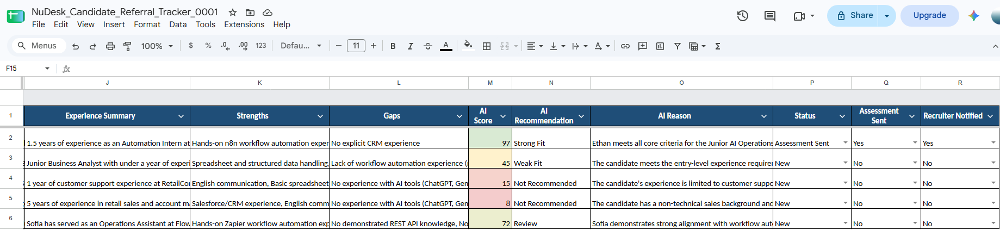
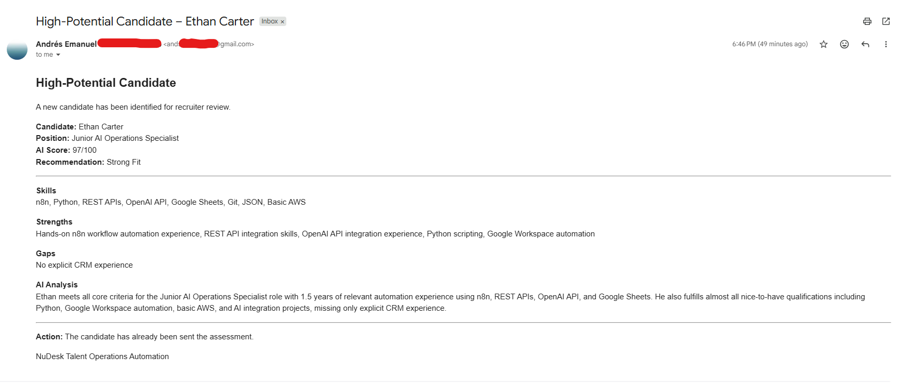

# NuDesk AI Candidate Referral Automation

AI-powered recruiting operations workflow built with **n8n, Google Gemini, Google Sheets, Gmail, and a custom HTML referral form**.

The goal is to automate the repetitive operational steps that happen after an employee submits a candidate referral.

> This repository is a technical assessment/demo. All candidate data and CVs included here are synthetic.



## What the workflow does

1. Receives candidate information and a PDF resume from the referral form.
2. Checks Google Sheets for an existing candidate email.
3. Extracts text from the resume.
4. Evaluates the candidate with Google Gemini using a weighted scoring rubric.
5. Saves structured candidate data and AI analysis to Google Sheets.
6. Sends a confirmation email to the candidate.
7. Automatically advances candidates scoring **75 or higher** to the assessment.
8. Notifies the recruiter with the candidate score, strengths, gaps, and AI analysis.
9. Updates the candidate status in the tracker.
10. Saves CV/AI processing failures as `Processing Error` for manual review.

The AI score is used for **workflow routing**, not as a final hiring decision.

## Stack

- **Automation:** n8n Cloud
- **AI:** Google Gemini
- **CV parsing:** n8n Extract from File
- **Tracker:** Google Sheets
- **Email:** Gmail
- **Intake:** Custom HTML / JavaScript form

## Candidate routing

| Score | Recommendation | Automatic action |
| --- | --- | --- |
| 90–100 | Strong Fit | Assessment + recruiter notification |
| 75–89 | Good Fit | Assessment + recruiter notification |
| 60–74 | Review | Keep for review |
| 40–59 | Weak Fit | Keep for review |
| 0–39 | Not Recommended | Keep for review |

The scoring prompt awards points only for evidence present in the CV and includes safeguards against instructions embedded inside resume content.

## Validation results

| Candidate | Score | Result |
| --- | ---: | --- |
| Ethan Carter | 97 | Strong Fit — assessment sent |
| Sofia Martinez | 72 | Review — no automatic advancement |
| Daniel Brooks | 45 | Weak Fit — no automatic advancement |
| Emma Wilson | 15 | Not Recommended |
| Michael Turner | 8 | Not Recommended |

Duplicate detection and processing-error handling were also tested successfully.

## Screenshots

### Referral form



### Candidate tracker



### Recruiter notification



More screenshots are available in the [`screenshots/`](screenshots/) folder.

## Repository structure

```text
.
├── README.md
├── workflow/
│   └── candidate-referral-workflow.json
├── form/
│   └── NuDesk_Employee_Referral_Form.html
├── sample-data/
│   └── sample candidate CVs
└── screenshots/
    └── workflow and demo screenshots
```

## Setup

The files in this repository are sanitized. Live credentials and private endpoints are intentionally excluded.

To run the project:

1. Import `workflow/candidate-referral-workflow.json` into n8n.
2. Configure your own Gemini, Gmail, and Google Sheets credentials.
3. Select your candidate tracker spreadsheet.
4. Replace `recruiter@example.com` and `https://example.com/assessment` with your own values.
5. Publish the workflow and copy the production webhook URL.
6. In `form/NuDesk_Employee_Referral_Form.html`, replace:

```js
const WEBHOOK_URL = "https://YOUR-N8N-INSTANCE/webhook/candidate-referral";
```

with your own n8n production webhook URL.

## Reliability and security

The workflow includes:

- Duplicate candidate detection before AI processing
- Retry logic for CV extraction and AI evaluation
- `Processing Error` handling so applications are not lost
- Structured AI output validation
- Timestamp-based row updates
- Sanitized repository files with no live API keys, OAuth tokens, production webhook URL, or private assessment URL

## Future improvements

Possible production improvements include application IDs, centralized monitoring, authenticated intake, ATS/CRM integration, and source-agnostic candidate intake.

---

**NuDesk Recruiting Demo — AI-powered recruiting operations workflow**
